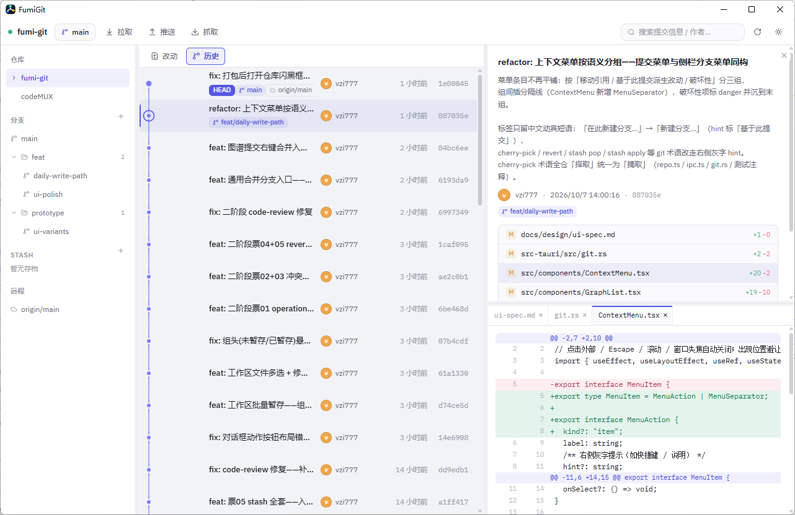

<div align="center">
  
  <h1>FumiGit</h1>
  <p>面向开发者的开源 Git 桌面客户端 —— <b>提交图谱是主角</b>，图形是第一操作面，其余功能围绕它组织。</p>
  <p>
    
    
    
    
  </p>
</div>

- **形态**：Tauri 2 桌面应用（Rust 后端 + React 19 前端）
- **Git 接入**：git CLI 是唯一后端（spawn 子进程 + porcelain 解析），行为与你本机的 git 完全一致
- **本地优先**：不绑定任何账号或云服务，直接打开本地仓库目录即可使用
- **首发平台**：Windows（架构保持平台中立，跨平台只差打包层）
- **许可**：Apache-2.0

---

## 界面

提交图谱 + 提交详情 + 文件 diff 同屏。上图为 FumiGit 自己仓库的开发态。



读图要点：

- 中栏是提交图谱，行内三列：提交信息 / 引用徽章（`HEAD`、`main`、`origin/main`）/ 作者 · 相对时间 · 短 hash
- 右栏上下分栏：上半是提交详情与文件改动列表（带 `+1 −0` 增删统计），下半是该文件的多 tab diff，tab 独立关闭
- 侧栏按 `feat/` `prototype/` 前缀把分支折叠成文件夹，组尾角标是分支数；上方是仓库列表，下方是 stash 与远程
- 「改动 / 历史」双 tab 在中栏顶部；图谱上的节点连线是 lane 分配结果

## 为什么又造一个 Git 客户端

大多数 Git GUI 把「文件列表」当第一操作面，历史被塞进二级视图；另一些重写 Git 实现（libgit2 等），行为和你在终端里用的 git 并不完全一致，遇到 hook、credential helper、LFS、签名、属性文件时就会露馅。

FumiGit 的两条硬约束：

1. **图谱优先**。历史、图谱、分支拓扑是主工作面，文件列表只作为提交详情的一部分出现。
2. **不重写 Git**。所有读写都是 spawn 真实 `git` 进程、解析 porcelain 输出。`core.hooksPath`、自定义 filters、`~/.gitconfig`、SSH agent、credential helper 全部天然生效 —— 因为用的就是你的 git。

## 功能

### 提交图谱

- 全分支提交图谱（`--all`），lane 分配与即时回收，多分支仓库不膨胀
- 行内信息三列布局：提交信息 / 引用徽章（HEAD、远程分支、标签，最多 4 枚）/ 作者 · 相对时间 · 短 hash
- 侧栏分支按 `feature/` 前缀折叠成文件夹，组内外排序，折叠状态持久化
- 点击侧栏分支或标签：自动跳到历史 tab、选中 tip 提交、滚动到列表顶
- 提交信息 / 作者 / hash 搜索过滤，滚动位置在 tab 切换间保持
- 右栏提交详情 → 点文件在下半区展开 diff，多 tab 独立关闭

### 工作区

- 「改动 / 历史」双 tab，默认进改动
- 已暂存 / 未暂存分组，支持 Ctrl 多选、Shift 范围选择，右键批量操作
- 逐文件 diff 与提交 diff 共用同一套 diff 视图
- 丢弃改动覆盖四种粒度：未暂存、已暂存、已暂存新增、全部（含未跟踪文件）

### 分支与暂存

- 新建 / 删除 / 重命名 / 切换分支，删除前校验未合并提交数
- reset 到任意 ref，soft / mixed / hard 三种模式
- 「合并 X 到当前分支」：侧栏分支右键、图谱提交右键两个入口
- stash push / list / diff / apply / pop / drop

### 远程

- fetch / pull / push，push 上游（`push -u`）
- 远程分支列表与「合并上游」

### 历史改写与冲突

- revert、cherry-pick，空提交场景可 skip 或 keep
- 三阶段冲突视图：base / ours / theirs 并排，逐块取舍
- 「整文件采用我方 / 对方」、拼装结果写回工作区、继续 / 中止进行中的操作
- 冲突文件可用系统默认应用打开手动编辑

### 环境

- 深色 / 浅色 / 跟随系统三态主题，CSS 变量驱动
- 监听 `.git` 与工作区：终端或其他工具改了仓库，自动刷新（500ms 防抖）
- 侧栏宽度像素级拖拽并持久化，右栏按上下文显隐

## 架构

```
React 19 前端
  src/components/     UI（Sidebar / GraphList / StagePanel / DiffView / ConflictView …）
  src/stores/repo.ts  zustand，唯一业务状态源
  src/graph/lane.ts   图谱 lane 分配（纯函数，可测）
  src/lib/ipc.ts      IPC 唯一出口，类型化封装
         │ invoke
         ▼
Rust 后端（src-tauri）
  commands.rs   Tauri 命令层，参数校验与 GitError 规整
  git.rs        git 子进程封装（唯一 Git 入口）
  watcher.rs    .git 目录监听 → repo-changed 事件
  config.rs     应用配置与最近仓库
```

两条边界，改代码前先看：

- **Git 只能从 `src-tauri/src/git.rs` 进入**。所有读写走真实 git 进程 + porcelain 解析，不引入 libgit2 / gitoxide 作为行为源。
- **前端只能从 `src/lib/ipc.ts` 调用后端**。组件不直接 `invoke` 裸字符串。新增命令三处同步：`commands.rs` 定义 → `lib.rs` 注册 `invoke_handler` → `ipc.ts` 加类型化包装；数据结构在 `src/lib/types.ts`。

## 开发

```bash
pnpm install
pnpm tauri dev      # 开发运行
pnpm tauri build    # 打包（Windows）
```

改完图标源文件（`docs/design/brand/app-icon.png`）后重新生成全套尺寸：

```bash
pnpm tauri icon docs/design/brand/app-icon.png
```

### 测试

```bash
pnpm test    # 前端单测（vitest）：图谱 lane / refs 分组 / store 纯逻辑
cargo test   # 在 src-tauri/ 下：真实 git + tempfile 构造夹具仓库，不 mock git
```

前端测试只覆盖纯逻辑；涉及真实 git 行为的验证一律在 Rust 侧，用真实仓库跑。

### 性能验收

大仓库图谱性能用生成的夹具仓库验收（git fast-import）：

```bash
scripts/gen-perf-repo.sh <目标目录> [提交数]
```

## 文档

- [UI 设计规范](docs/design/ui-spec.md) —— 三栏工作台布局、主题令牌、图谱配色（2026-10 定稿）
- [领域模型](CONTEXT.md) —— 术语与边界
- UI 原型全量归档（含落选变体）：分支 `prototype/ui-variants`

## 路线

v0.1 已打通最小闭环：仓库列表 → 提交图谱 → 提交详情与 diff → 暂存 / 取消暂存 / 提交 → fetch / pull / push。

计划中（按优先级）：

- 交互式 rebase
- 大仓库虚拟滚动与图谱渲染性能收敛
- submodule 与 LFS 状态展示
- 安装包与自动更新
- macOS / Linux 打包

## 参与

Issue 和 PR 都欢迎。动手前建议读 [AGENTS.md](AGENTS.md)（架构边界与项目约定）和 [UI 设计规范](docs/design/ui-spec.md)（改 UI 前必读，别自行发明样式值）。

## 许可

[Apache-2.0](LICENSE)